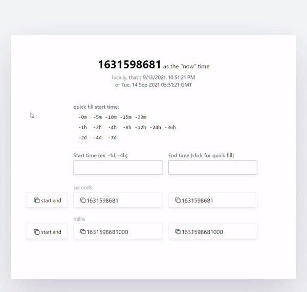

# [epochconverter2](https://epochconverter2.colby.cc/)

A relative-time alternative to epochconverter.com. More UX, less typing.

It is targeted at engineers who may be working with timestamped data like metrics or logs, but maybe your metrics/logs app doesn't have _this simple_ of an absolute-timestamp picker. Made with React and Tailwind CSS.

## Features

On epochconverter.com the main way to get the epoch time for a past timestamp is to have to tediously enter hour/minute/seconds while get the AM/PM and time zone correct. Reclaim your free time with this alternate app's ability to:

-   One-click copy paste
-   One-click to fill in common relative time presets
